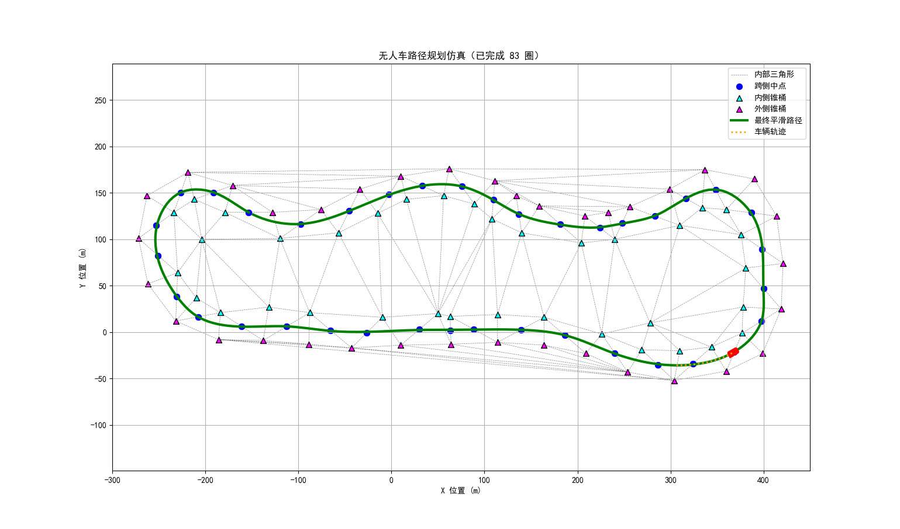

# fsac-path-planning-sim
# 无人车路径规划与纯追踪控制仿真

这是一个使用 Python 实现的无人车路径规划与跟踪仿真项目。它模拟了一辆自主赛车如何根据赛道锥桶生成平滑路径，并使用纯追踪（Pure Pursuit）算法沿着路径行驶。




## 功能特点

*   **路径规划**：
    *   使用德劳内三角剖分（Delaunay Triangulation）处理赛道锥桶。
    *   提取赛道内部三角形的跨侧边中点作为路径控制点。
    *   使用 B 样条插值（B-spline Interpolation）生成平滑的参考路径。
*   **路径跟踪**：
    *   实现了经典的纯追踪（Pure Pursuit）控制算法。
    *   包含预瞄点平滑和方向一致性判断，防止车辆掉头。
*   **可视化**：
    *   使用 Matplotlib 实时绘制赛道、参考路径、车辆位置和行驶轨迹。

## 安装与依赖

在运行此项目之前，请确保你已经安装了 Python 3.x 以及以下库：

```bash
pip install numpy matplotlib scipy